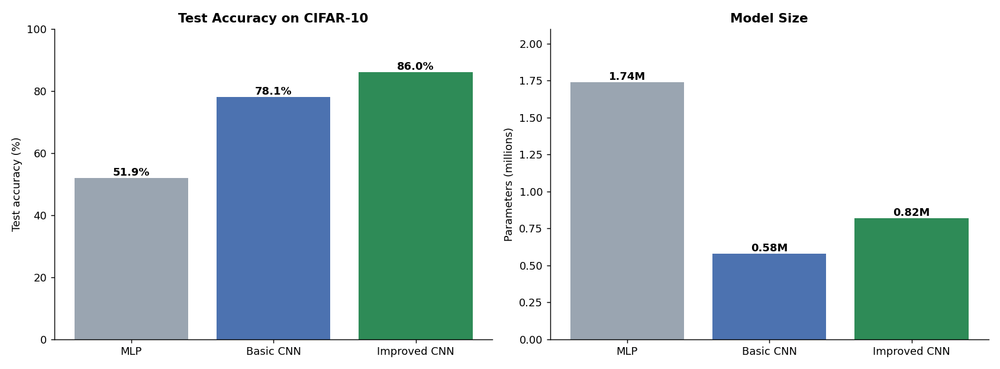
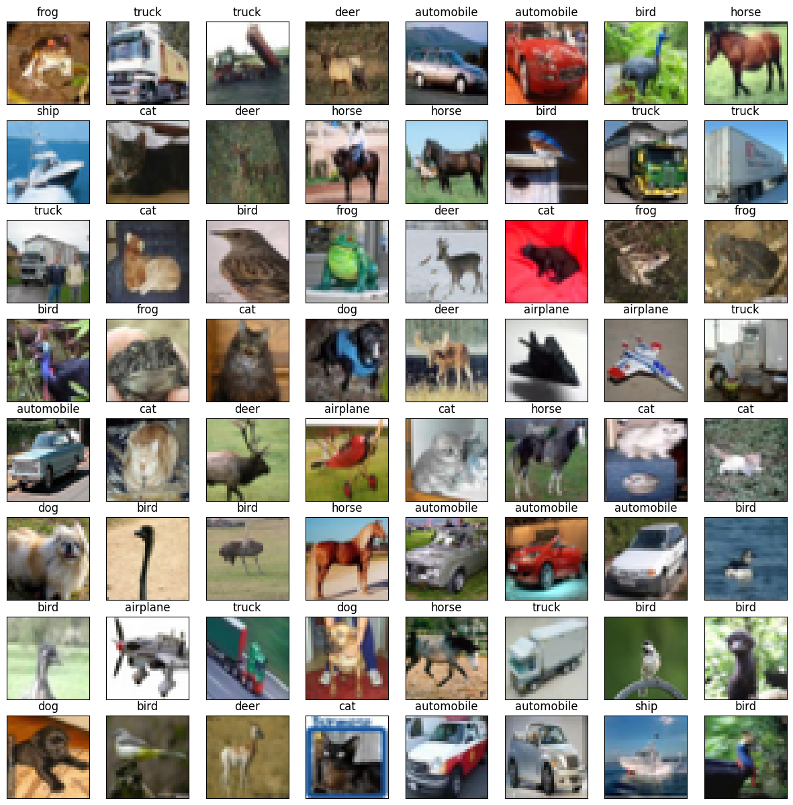
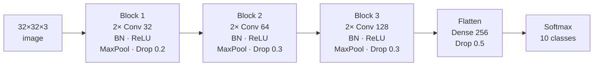
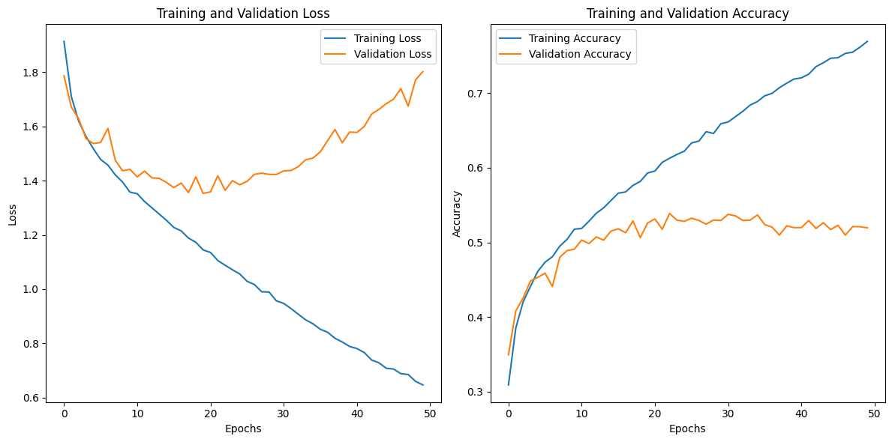
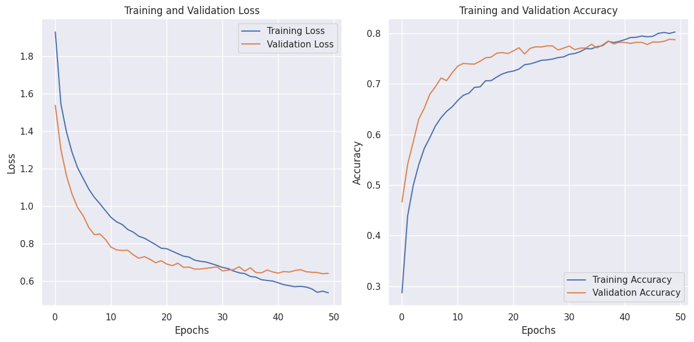
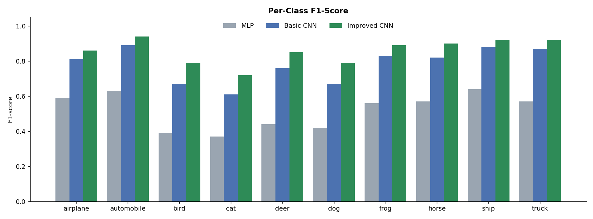
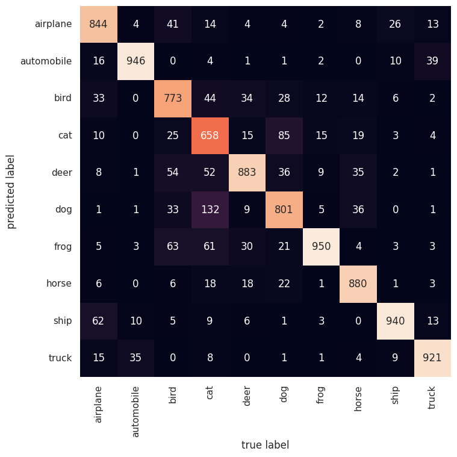
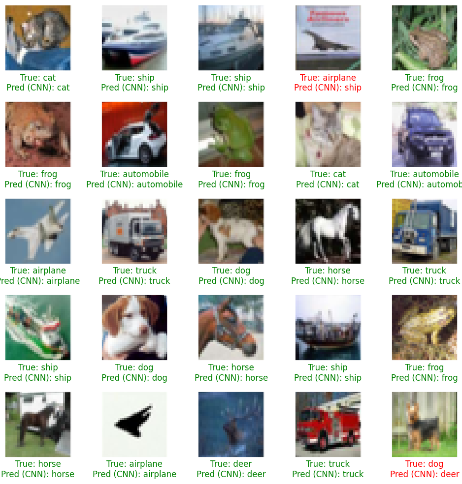

# 🖼️ CIFAR-10 Image Classification: MLP vs CNN

[](https://colab.research.google.com/github/MMujtabaX/cv/blob/main/CV_S01E01_CNNs_shared.ipynb)


Why do convolutional networks dominate computer vision? This project answers that by training three models of increasing sophistication on **CIFAR-10**: a plain **MLP**, a **basic CNN**, and an **improved CNN** with Batch Normalization, He initialization and learning-rate scheduling. The result goes from **52% to 86%** accuracy.

<p align="center">
  
</p>

## 📌 The Dataset

**CIFAR-10:** 60,000 color images (32×32 pixels) in 10 balanced classes, split into **50,000 training** and **10,000 test** images.

<p align="center">
  
</p>

`airplane` · `automobile` · `bird` · `cat` · `deer` · `dog` · `frog` · `horse` · `ship` · `truck`

Pixel values are scaled from [0, 255] to [0, 1].

## 🧱 The Three Models

| Model | Architecture | Parameters |
|-------|--------------|------------|
| **MLP** | Flatten → Dense 512 → 256 → 128 → 10 | 1.74M |
| **Basic CNN** | 2 conv blocks (Conv2D + MaxPool + Dropout) → Dense | 0.58M |
| **Improved CNN** | 3 VGG-style conv blocks (Conv → BN → ReLU, ×2 per block) with 32/64/128 filters → Dense 256 → Dropout 0.5 → 10 | 0.82M |

The improved CNN also uses **He-normal initialization**, **ReduceLROnPlateau** (halving the learning rate when validation loss stalls), and **early stopping**.



## 📊 Results

| Model | Test Accuracy | Test Loss | Parameters |
|-------|---------------|-----------|------------|
| MLP | 51.9% | 1.804 | 1.74M |
| Basic CNN | 78.1% | 0.648 | 0.58M |
| **Improved CNN** | **86.0%** | **0.491** | 0.82M |

**The basic CNN beats the MLP by 26 points with a third of the parameters.** An MLP flattens the image into a 3,072-long vector and loses all spatial structure. Convolutions share weights across the image and learn local patterns (edges, textures, shapes) that work anywhere in the frame.

### Training behavior

<table>
  <tr>
    <td></td>
    <td></td>
  </tr>
  <tr>
    <td align="center"><b>MLP: heavy overfitting (77% train vs 52% validation)</b></td>
    <td align="center"><b>Basic CNN: train and validation stay close (80% vs 79%)</b></td>
  </tr>
</table>

### Per-class performance

<p align="center">
  
</p>

Every class improves with each model. **Vehicles are easiest** (automobile F1 0.94, ship and truck 0.92). **Animals are hardest**, especially **cat (0.72)**, which is most often confused with dog: **132 cats were predicted as dogs**, since the two look very similar at 32×32 resolution.

<table>
  <tr>
    <td></td>
    <td></td>
  </tr>
  <tr>
    <td align="center"><b>Improved CNN confusion matrix</b></td>
    <td align="center"><b>Sample predictions (green = correct, red = wrong)</b></td>
  </tr>
</table>

## 💡 Key Takeaways

- **Architecture matters more than size:** the CNN beats a 3× larger MLP by 26 points.
- **Batch Normalization + He initialization** made a deeper network train stably and fast.
- **Dropout at increasing rates** (0.2 → 0.3 → 0.5) controlled overfitting as the network got deeper.
- **Learning-rate scheduling** (ReduceLROnPlateau) squeezed out extra accuracy late in training.
- The improved CNN's best epoch was its **last** (epoch 50), so it had not finished learning. More epochs would likely help.

## 🔮 Next Steps

- **Data augmentation** (random flips, shifts, crops), typically worth several accuracy points on CIFAR-10
- **Train longer**, since the improved model was still improving at epoch 50
- **Transfer learning** with a pretrained ResNet or EfficientNet
- Replace `Flatten` with `GlobalAveragePooling2D` to cut parameters

## 🚀 Run It

Click the **Open in Colab** badge above and select a **GPU runtime** (Runtime → Change runtime type → T4 GPU), or run it locally:

```bash
pip install tensorflow scikit-learn seaborn matplotlib pandas jupyter
jupyter notebook CV_S01E01_CNNs_shared.ipynb
```

CIFAR-10 downloads automatically through Keras.

## 👤 Author

**Muhammad Mujtaba Khan Suri** — CS @ UBIT, University of Karachi
[GitHub](https://github.com/MMujtabaX)
